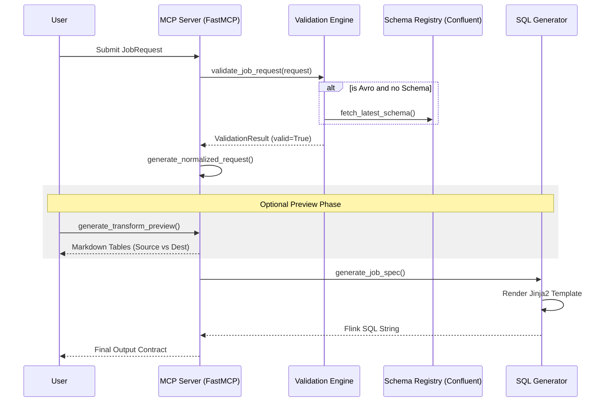
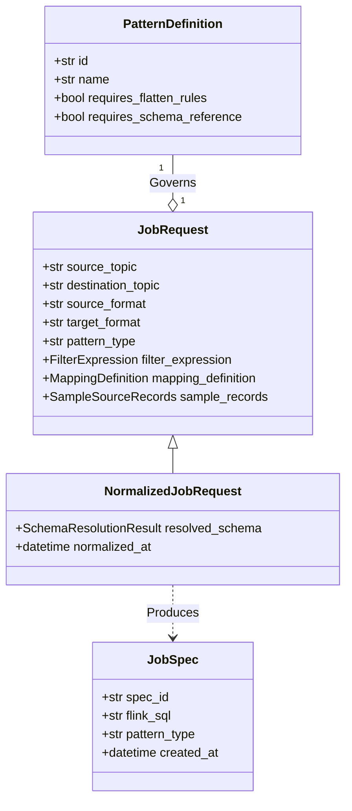

# Flink Codex Architecture

Flink Codex is a specialized MCP (Model Context Protocol) server designed to facilitate the deterministic creation of Flink SQL clean jobs on Confluent Cloud. It bridges the gap between high-level user requirements and valid, deployable Flink SQL.

## 1. System Overview

The system follows a strict **Request -> Validate -> Normalize -> Generate** pipeline.

### Core Components
- **Catalog (`catalog.py`)**: The source of truth for all supported transformation patterns.
- **Models (`models.py`)**: Pydantic definitions for requests, specs, and validation results.
- **Server (`server.py`)**: The FastMCP entry point exposing tools to the LLM/Codex.
- **Validators (`validation.py`)**: Logic for syntax checking, schema compatibility, and pattern-specific rules.
- **Generator (`sql_generator.py`)**: Jinja2-based engine that renders Flink SQL from validated specifications.

## 2. Execution Flow

The flow typically starts when a user (via Claude or Codex) provides a source/target format and a transformation intent.



## 3. Class Diagram

The system uses a strictly typed model hierarchy to ensure data integrity across the MCP boundary.



## 4. Starting the Server

The server uses `FastMCP` and can be run via the `fastmcp` CLI or as a standard Python script.

### Local Development
```bash
# Run with live reloading for development
fastmcp dev src/flink_codex/server.py

# Run in standard mode
fastmcp run src/flink_codex/server.py
```

## 5. Deployment in Claude / Codex

### Claude Desktop Configuration
To use this server within Claude Desktop, add the following to your `claude_desktop_config.json`:

```json
{
  "mcpServers": {
    "flink-codex": {
      "command": "python",
      "args": [
        "-m",
        "flink_codex.server"
      ],
      "env": {
        "PYTHONPATH": "/path/to/project/src"
      }
    }
  }
}
```

### Codex / Agent Integration
The project includes a `.codex/` directory which allows it to be used as a "Skill" or "Agent" in compatible IDEs.
1. **Config**: `.codex/config.toml` defines the entry point.
2. **Instructions**: `AGENTS.md` provides the "System Prompt" for the agent, explaining the execution flow (Validate -> Normalize -> Preview -> Generate).

## 6. Patterns Catalog
Supported patterns are defined in `src/flink_codex/catalog.py`. Each pattern maps to a specific Jinja2 template in the `templates/` directory, ensuring that the logic for "Nested JSON to Flat Avro" is isolated and deterministic.
